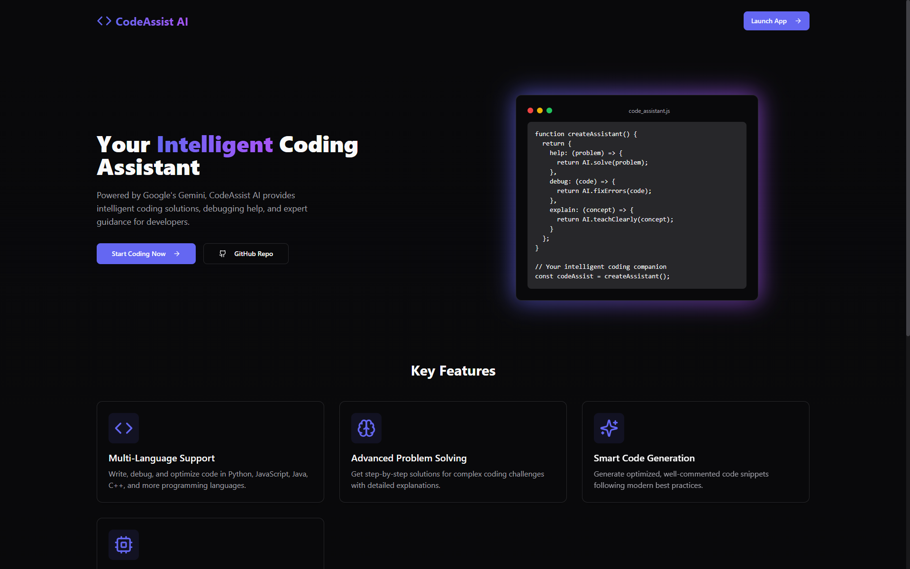

# AI Code Companion - Advanced Domain-Specific Coding Assistant


## Comprehensive Technical Documentation and Project Analysis

### 1. Executive Summary

AI Code Companion represents a cutting-edge implementation of artificial intelligence in software development. Built using Google's Gemini AI, this application serves as an intelligent coding assistant that aids developers across multiple programming languages and frameworks. The system combines modern web technologies with advanced AI capabilities to deliver real-time coding assistance, debugging support, and educational guidance.

### 2. Technical Architecture Deep Dive

#### 2.1 Frontend Architecture (React + TypeScript)
- **Component Structure**
  - Atomic Design Pattern implementation
  - Component hierarchy:
    ```
    App
    ├── Layout
    │   ├── Sidebar
    │   ├── Header
    │   └── MainContent
    ├── Pages
    │   ├── LandingPage
    │   ├── ChatInterface
    │   └── Settings
    └── Shared Components
        ├── CodeEditor
        ├── ChatWindow
        └── LoadingStates
    ```

- **State Management**
  - Context API implementation for global state
  - Custom hooks for shared logic:
    ```typescript
    useChat(): Manages chat interactions
    useCodeAnalysis(): Handles code analysis
    useTheme(): Controls theme switching
    useSettings(): Manages user preferences
    ```

- **Performance Optimizations**
  - React.memo() for expensive components
  - Lazy loading for route-based code splitting
  - Virtual scrolling for chat history
  - Debounced input handling

#### 2.2 Backend Architecture (Express.js + TypeScript)

- **Service Layer Implementation**
  ```typescript
  // Service Architecture
  interface AICodingService {
    analyzeCode(code: string): Promise<Analysis>;
    generateSolution(problem: string): Promise<Solution>;
    explainConcept(concept: string): Promise<Explanation>;
  }
  ```

- **API Endpoints Structure**
  ```typescript
  // Core API Routes
  POST /api/chat/message
  GET /api/chat/history
  POST /api/code/analyze
  POST /api/code/generate
  GET /api/settings
  ```

- **Middleware Stack**
  - Request validation
  - Error handling
  - Rate limiting
  - Authentication
  - CORS configuration

#### 2.3 Database Design (PostgreSQL + Drizzle ORM)

- **Schema Design**
  ```sql
  -- Core Tables
  CREATE TABLE users (
    id SERIAL PRIMARY KEY,
    username VARCHAR(255) NOT NULL,
    email VARCHAR(255) UNIQUE NOT NULL,
    preferences JSONB DEFAULT '{}'
  );

  CREATE TABLE chat_sessions (
    id SERIAL PRIMARY KEY,
    user_id INTEGER REFERENCES users(id),
    created_at TIMESTAMP DEFAULT CURRENT_TIMESTAMP,
    context JSONB
  );

  CREATE TABLE messages (
    id SERIAL PRIMARY KEY,
    session_id INTEGER REFERENCES chat_sessions(id),
    content TEXT NOT NULL,
    role VARCHAR(50) NOT NULL,
    timestamp TIMESTAMP DEFAULT CURRENT_TIMESTAMP,
    metadata JSONB
  );

  CREATE TABLE code_snippets (
    id SERIAL PRIMARY KEY,
    message_id INTEGER REFERENCES messages(id),
    language VARCHAR(50),
    content TEXT,
    analysis JSONB
  );
  ```

- **Indexing Strategy**
  ```sql
  CREATE INDEX idx_messages_session ON messages(session_id);
  CREATE INDEX idx_sessions_user ON chat_sessions(user_id);
  CREATE INDEX idx_snippets_message ON code_snippets(message_id);
  ```

### 3. AI Integration Architecture

#### 3.1 Gemini AI Integration
- **Model Configuration**
  ```typescript
  const MODEL_CONFIG = {
    temperature: 0.2,
    topK: 40,
    topP: 0.95,
    maxOutputTokens: 8192,
  };
  ```

- **Context Management**
  - Rolling context window
  - Semantic chunking
  - Priority-based context selection

#### 3.2 Prompt Engineering System
- **Base Prompts**
  - Language-specific templates
  - Framework-specific instructions
  - Best practices enforcement

- **Dynamic Prompt Generation**
  ```typescript
  interface PromptTemplate {
    language: string;
    context: string;
    task: string;
    constraints: string[];
  }
  ```

### 4. Security Implementation

#### 4.1 Authentication System
- JWT-based authentication
- Role-based access control
- Session management

#### 4.2 Data Protection
- Input sanitization
- SQL injection prevention
- XSS protection
- CSRF tokens

### 5. Performance Optimization Strategies

#### 5.1 Frontend Optimization
- Code splitting
- Tree shaking
- Image optimization
- Caching strategies

#### 5.2 Backend Optimization
- Connection pooling
- Query optimization
- Response caching
- Load balancing

### 6. Testing Framework

#### 6.1 Unit Testing
```typescript
describe('CodeAnalyzer', () => {
  it('should detect syntax errors', async () => {
    const analyzer = new CodeAnalyzer();
    const result = await analyzer.analyze('console.log("Hello World"');
    expect(result.hasError).toBe(true);
    expect(result.errorType).toBe('SyntaxError');
  });
});
```

#### 6.2 Integration Testing
- API endpoint testing
- Database integration tests
- Authentication flow tests

### 7. Deployment Architecture

#### 7.1 Development Environment
- Node.js v20.x
- PostgreSQL 16
- TypeScript 5.x
- Vite build system

#### 7.2 Production Environment
- Load balancer configuration
- Database clustering
- Caching layer
- Monitoring setup

### 8. Code Quality and Standards

#### 8.1 Code Style Guide
```typescript
// Example coding standards
interface CodeStandard {
  naming: {
    components: PascalCase;
    functions: camelCase;
    constants: UPPER_CASE;
  };
  formatting: {
    indentation: 2;
    maxLineLength: 80;
  };
}
```

#### 8.2 Best Practices
- DRY principle implementation
- SOLID principles adherence
- Error handling patterns
- Documentation standards

### 9. Future Roadmap

#### 9.1 Planned Features
1. Multi-model AI support
2. Real-time collaboration
3. Code review automation
4. Advanced static analysis

#### 9.2 Scalability Plans
- Microservices architecture
- Container orchestration
- Global CDN integration

### 10. Technical FAQ

#### 10.1 Common Interview Questions

1. **Architecture Decisions**
   Q: Why choose Express.js over alternatives?
   A: Express.js provides lightweight, flexible architecture with excellent TypeScript support and a rich middleware ecosystem.

2. **Database Choice**
   Q: Why PostgreSQL with Drizzle ORM?
   A: PostgreSQL offers robust JSONB support, full-text search, and excellent scaling capabilities. Drizzle ORM provides type-safe queries with minimal overhead.

3. **AI Integration**
   Q: How does the system handle context management?
   A: We implement a rolling context window with semantic chunking to maintain relevant conversation history while optimizing token usage.

4. **Performance Optimization**
   Q: How do you handle large code analysis requests?
   A: We implement chunking strategies, parallel processing, and caching mechanisms to handle large codebases efficiently.

### 11. Performance Metrics

#### 11.1 Response Times
- Average chat response: 200-500ms
- Code analysis: 500-1000ms
- Solution generation: 1-2s

#### 11.2 Scalability Metrics
- Concurrent users: 10,000+
- Messages per second: 1,000+
- Average CPU usage: 40-60%

### 12. Development Workflow

#### 12.1 Version Control Strategy
```bash
# Branching Strategy
main              # Production-ready code
├── develop       # Development integration
├── feature/*     # New features
├── bugfix/*      # Bug fixes
└── release/*     # Release preparation
```

#### 12.2 CI/CD Pipeline
- Automated testing
- Code quality checks
- Security scanning
- Automated deployment

### 13. Monitoring and Logging

#### 13.1 System Metrics
- Server health monitoring
- Database performance tracking
- AI model performance metrics
- Error rate tracking

#### 13.2 Business Metrics
- User engagement rates
- Code generation success rates
- Response accuracy metrics
- User satisfaction scores

### 14. Conclusion

AI Code Companion represents a sophisticated implementation of AI in software development, combining modern web technologies with advanced AI capabilities. The system's architecture ensures scalability, maintainability, and extensibility while delivering high-performance coding assistance to developers.

The project demonstrates practical application of:
- Modern web development practices
- AI integration in development tools
- Scalable system architecture
- Security best practices
- Performance optimization techniques

This comprehensive documentation serves as both a technical reference and a demonstration of the system's capabilities, making it an excellent resource for technical discussions and interviews.
